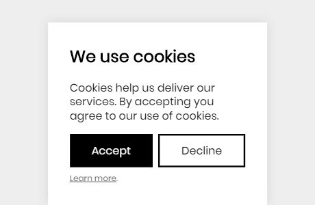

# EU Cookie Confirm

_Version 1.0_ - See the [changelog](docs/CHANGELOG.md)

If you like this library, please consider [making a donation](https://www.paypal.me/DevoneraAB) to support my work.



## About

**Filesize:** 0.4 kB gzipped

Really simple library with pure vanilla javascript, no jQuery involved.

- Supports accessability with aria attributes
- Supports options
- Supports animations
- Supports multiple styles
- Supports position

To remember the choice made by the user, local storage is used.

## Demos

You can make the html and css how you like, but here are some demos for inspiration.

- [Style box](https://csspoo.com/eu-cookie-confirm/examples/style-box.html)
- [Style nag](https://csspoo.com/eu-cookie-confirm/examples/style-nag.html)
- [No style](https://csspoo.com/eu-cookie-confirm/examples/style-no.html)

You can also get them in [examples](examples).

## Setup

Add the stylesheet.

```html
<link rel="stylesheet" href="assets/css/dist/style.css" />
```

Add the confirm box. To just make it work, not much HTML is required.

```html
<div id="ecc" hidden>
  <button data-accept>Accept</button>
  <button data-cancel>Decline</a>
</div>
```

Add the javascript.

```html
<script src="assets/js/dist/script.js"></script>
<script>
  let ecc = new euCookieConfirm();
  ecc.script(() => {
    console.log("Place your script here, for example Google Analytics.");
  });
</script>
```

## Examples

In the [examples folder](examples) folder you can find complete examples.

### `style-box.html`

By default the dialog will appear at the bottom, but if you add the class `ecc-top` it will be placed at the top instead.

### `style-no.html`

No style and minimal html is added. It just shows two buttons. However it's still fully functional. You can use it as a starting point if you want to create something from scratch.

## Options

The function call below will not change anything compared to `euCookieConfirm()`, because every option is set to its default value.

```js
let new = euCookieConfirm({
  localStorageName: "eu-cookie-confirm",
  selectorAccept: "[data-accept]",
  selectorClose: "[data-cancel]",
  selectorMessage: "#ecc"
});
```

| Option             | Default               | Description                                                          |
| ------------------ | --------------------- | -------------------------------------------------------------------- |
| `localStorageName` | `"eu-cookie-confirm"` | The name that will be stored in the local storage.                   |
| `selectorAccept`   | `"[data-accept]"`     | The selector of the element that can be clicked to allow cookies.    |
| `selectorClose`    | `"[data-cancel]"`     | The selector of the element that can be clicked to disallow cookies. |
| `selectorMessage`  | `"#ecc"`              | The selector of the element box that contains the cookie question.   |

## Requirements

This library is tested with the following browsers.

- Chrome
- Edge
- Firefox
- Opera

## Disclaimer

This library is provided "as is" with no guarantee. Use it at your own risk and always test it yourself before using it in a production environment. If you find any issues, please create a new issue.

## Inspiration

- https://github.com/Alex-D/Cookies-EU-banner

## Credits

- [Jens Törnell](https://github.com/jenstornell)

## License

[MIT](LICENSE)
