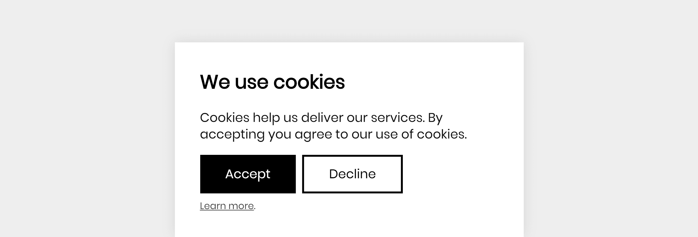

# EU Cookie Confirm

_Version 3.0_ - See the [changelog](docs/CHANGELOG.md)

If you like this library, please consider [making a donation](https://www.paypal.me/DevoneraAB) to support my work.



## About

Really simple library with pure vanilla javascript, no jQuery involved. It's just 1.0 kB minified and 0.4 kB gzipped.

- Supports accessability with aria attributes
- Supports options

1. The first time the user is visiting the page, the user will see a dialog box.
1. If the user click the accept button, the script that contains cookies will always be loaded from now on.
1. If the user click the cancel button, the script that contains cookies will never be loaded from now on.
1. On the next visit, no matter which button the visitor previously clicked on, the dialog box is not shown again.

To rememder the choice made by the user, local storage is used.

## Setup

Add the stylesheet.

```html
<link rel="stylesheet" href="assets/css/dist/style.css" />
```

Add the confirm box. To just make it work, not much HTML is required.

<div id="ecc" hidden>
  <button data-accept>Accept</button>
  <button data-cancel>Decline</a>
</div>

```html
<script src="assets/js/dist/script.js"></script>
<script>
  let ecc = new euCookieConfirm();
  ecc.script(() => {
    console.log("Place your script here, for example Google Analytics.");
  });
</script>
```

## Examples

In the [examples folder](examples) folder you can find complete examples.

By default the dialog will appear at the bottom, but if you add the class `ecc-top` it will be placed at the top instead.

## Options

The function call below will not change anything compared to `euCookieConfirm()`, because every option is set to its default value.

```js
let new = euCookieConfirm({
  localStorageName: "eu-cookie-confirm",
  selectorAccept: "[data-accept]",
  selectorClose: "[data-cancel]",
  selectorMessage: "#ecc"
});
```

| Option             | Default               | Description                                                          |
| ------------------ | --------------------- | -------------------------------------------------------------------- |
| `localStorageName` | `"eu-cookie-confirm"` | The name that will be stored in the local storage.                   |
| `selectorAccept`   | `"[data-accept]"`     | The selector of the element that can be clicked to allow cookies.    |
| `selectorClose`    | `"[data-cancel]"`     | The selector of the element that can be clicked to disallow cookies. |
| `selectorMessage`  | `"#ecc"`              | The selector of the element box that contains the cookie question.   |

## Requirements

This library is tested with the following browsers.

- Chrome
- Edge
- Firefox
- Opera

## Disclaimer

This library is provided "as is" with no guarantee. Use it at your own risk and always test it yourself before using it in a production environment. If you find any issues, please create a new issue.

## Inspiration

- https://github.com/Alex-D/Cookies-EU-banner

## Credits

- [Jens Törnell](https://github.com/jenstornell)

## License

[MIT](LICENSE)
